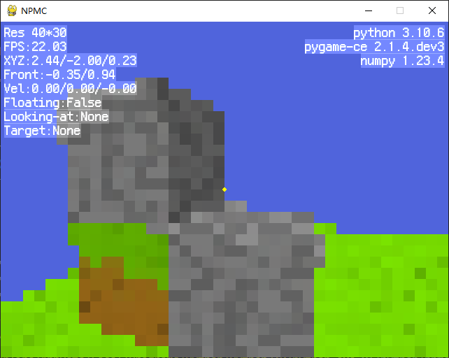

# MineNp
### 基于numpy和pygame的沙盒游戏。

- 使用用且只用numpy和pygame库
- 不使用GPU渲染
- 不使用OpenGL等现成的3d图形库
- 代码优先保证性能（保证能玩），其次是易读性
- 代码行数：~~500行~~ 1000行以内

### 目前已经实现：
- 跑跳、飞行
- 放置、挖掘方块
- 按中键获取方块
- 调试信息

### 将要实现：  
- ~~你们想要什么，写个issue或者开个PR吧~~

### 字体：[方舟像素体（缝合版）](https://github.com/TakWolf/fusion-pixel-font)

### 协议：**LGPL**

### *向Minecraft致敬*
